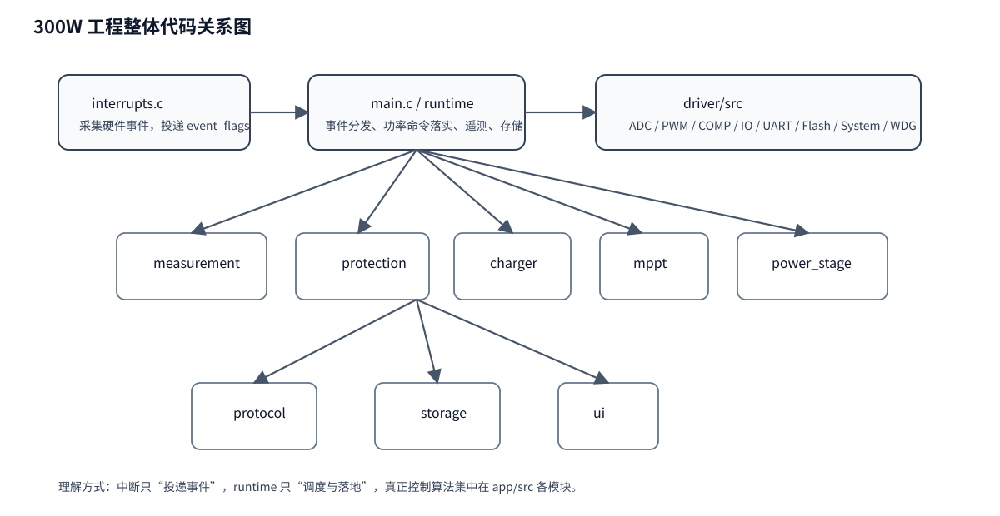

# 01｜系统总览与代码地图

## 1. 工程分层先看懂

当前 300W 工程可以粗分为三层：

1. **driver/src**：直接碰寄存器、DDL、GPIO、ADC、PWM、UART、Flash。
2. **app/src**：产品逻辑层，负责测量、MPPT、充电、保护、协议、存储、UI。
3. **main.c + interrupts.c**：运行调度层，把 ISR 事件和业务模块串起来。

这和很多“功能代码直接写在中断里”的旧项目不同。这个工程是明显的 **事件驱动 + 两层控制结构**。

## 2. 你先把“谁不该做什么”记住

### driver 不该做什么

- 不负责 MPPT 算法。
- 不负责充电状态机。
- 不负责电池档案判断。
- 不负责产品协议业务含义。

它只负责：**把硬件动作做对**。

### app 模块不该做什么

- 不直接写寄存器。
- 不直接访问 GPIO 口寄存器。
- 不直接决定中断优先级。
- 不直接擦写具体 Flash 控制寄存器。

它只负责：**把产品逻辑算对**。

### runtime 不该做什么

- 不在 ISR 里跑复杂算法。
- 不把 Driver 和算法揉在一起。
- 不让任何模块绕过 `power_stage` 去直接改 PWM 占空比。

它只负责：**把合适的数据，在合适的时刻，送到合适的模块**。

## 3. 代码地图：每个核心文件干什么

| 文件 | 角色 | 你读它时关注什么 |
|---|---|---|
| `app/src/main.c` | 调度中枢 | 整个系统 1ms/10ms 是怎么跑起来的 |
| `app/src/measurement.c` | 测量链 | ADC 原始码怎样变成电压/电流/温度 |
| `app/src/charger.c` | 充电状态机 | TC/CC/CV/Float/Complete 如何切换 |
| `app/src/mppt.c` | MPPT 算法 | PV 电压参考如何调整、如何输出理论功率 |
| `app/src/power_stage.c` | 功率级执行状态机 | 什么时候准许发波、什么时候闭继电器 |
| `app/src/protection.c` | 保护链 | 哪些故障会锁存、什么时候允许恢复 |
| `app/src/protocol.c` | UART 协议 | 字节流如何解析成设置/复位/遥测 |
| `app/src/storage.c` | Flash 持久化 | 参数和能量统计如何掉电保存 |
| `app/src/ui.c` | 指示灯 | RUN/FAULT 双灯如何闪烁 |
| `app/src/interrupts.c` | 中断桥接 | ISR 里到底做了什么、没做什么 |

## 4. 运行主线：一条线串起全部模块

上电以后不是直接 MPPT，而是：

1. `main()` 完成最小安全态初始化；
2. `aurora_runtime_init()` 初始化驱动和应用模块；
3. ADC DMA 连续产生数据块；
4. `measurement` 发布测量快照；
5. `protection` 先给出是否安全；
6. `charger` 给出电池侧目标；
7. `mppt` 给出 PV 侧理论功率请求；
8. `power_stage` 决定是否允许 PWM、继电器、Duty；
9. `apply_power_command()` 才真正调用 `drv_pwm_*` 和 `drv_io_set_relay()`。

## 5. 先读代码时最重要的三个结构体

### `aurora_app_t`

它是 **业务组合根**。里面装了：measurement、charger、mppt、power_stage、protection、storage、protocol、ui 等所有业务状态。

### `aurora_runtime_t`

它是 **运行组合根**。除了 `aurora_app_t`，还带着：

- 事件位 `event_flags`
- 待处理故障 `pending_fault_mask`
- UART 环形缓冲
- ADC 双半缓冲处理标记
- 看门狗票据

### `aurora_measurement_t`

它是 **控制链里最重要的“事实源”**。后面 charger、mppt、protection、telemetry 大量都依赖它。

## 6. 推荐的第一轮阅读方法

第一轮不要抠每一行，重点看：

- public API
- 状态枚举
- 关键结构体
- 模块间输入/输出

第二轮再去看静态辅助函数，例如：

- `power_to_duty()`
- `voltage_power_target()`
- `adaptive_step_mv()`
- `condition_held()`
