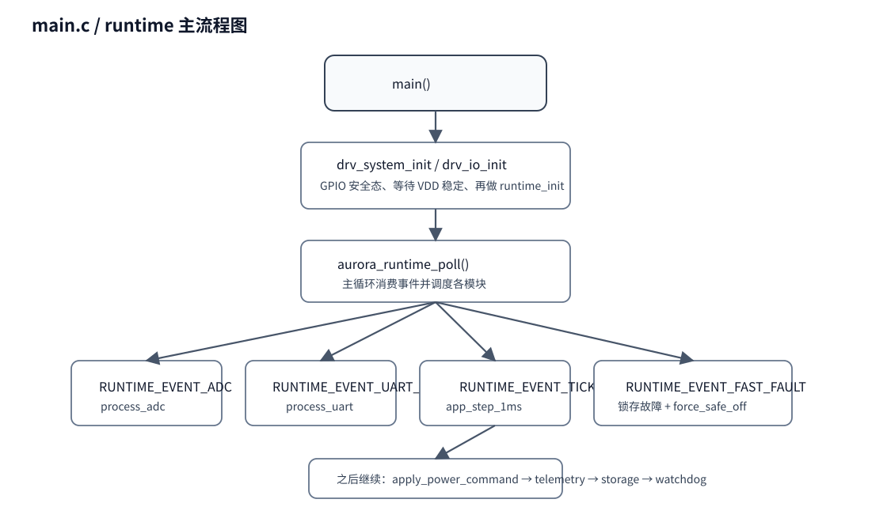

# 02｜main 与 interrupts 运行入口分析

## 1. 先看两个文件的分工

- `interrupts.c`：硬件中断入口，只做 **“快动作 + 投递事件”**。
- `main.c`：真正的运行调度中心，在主循环里完成 **“取事件 → 跑算法 → 落地硬件动作”**。

这套设计的核心意义是：

> **让 ISR 尽量短、可控、可证明；让复杂逻辑在主循环里做。**

## 2. main() 做了什么

`main()` 的流程很短，但非常关键：

1. `drv_system_init()`：建立系统时钟、时基等基础环境；
2. `drv_io_init()`：初始化继电器、LINK、LED 等 GPIO；
3. 先把 Relay / Link / LED 放到安全态；
4. `drv_system_wait_for_supply_stable()`：确认 MCU 供电稳定；
5. `aurora_runtime_init()`：初始化完整运行时；
6. 进入死循环，反复执行 `aurora_runtime_poll()`。

### 为什么 main() 先等供电稳定？

因为这是 PV 供电系统，弱光或电压晃动时，如果 MCU 还没稳就提前启动 ADC/PWM，容易出现：

- 程序刚启动就误动作；
- 参数加载不完整；
- 保护链状态异常；
- 功率器件在不稳定供电下被拉起。

所以这里不是“形式化等待”，而是实际的安全门禁。

## 3. aurora_runtime_init() 是第二入口

你可以把 `aurora_runtime_init()` 看成“系统真正启动”的入口。

### 它做的事按顺序是：

1. 配置中断优先级；
2. 再次把 Relay / Link / LED 拉回安全态；
3. 初始化看门狗；
4. 初始化 PWM；
5. `force_safe_off()` 强制确保关波；
6. 初始化 COMP、ADC、UART；
7. 通过 `drv_board_get_adc_calibration()` 读取板级标定；
8. `aurora_app_init()` 初始化所有业务模块；
9. `load_storage()` 从 Flash 恢复参数；
10. 启动 ADC DMA；
11. 标记 `runtime->initialized = true`。

### 你读源码时的关注点

- 为什么 `drv_pwm_init()` 后立刻 `force_safe_off()`？
- 为什么标定数据不是 app 自己算，而是从 `drv_board` 来？
- 为什么 Storage 在 App 初始化后再加载？

这几个点都体现了工程分层思想。

## 4. aurora_runtime_poll() 是真正的调度器

这个函数最重要。它每次主循环都做下面几件事：

1. 原子读取 `event_flags`；
2. 如果有 `FAST_FAULT`，先锁存故障并 `force_safe_off()`；
3. 如果有 `ADC` 事件，调用 `process_adc()`；
4. 如果有 `UART_RX` 事件，调用 `process_uart()`；
5. 如果有 `TICK` 事件，调用 `aurora_app_step_1ms()`；
6. 调用 `runtime_fast_ocp_recovery()`；
7. 调用 `apply_power_command()`；
8. 周期性主动上报遥测；
9. 处理存储落盘；
10. 检查看门狗票据。

### 你要建立的理解

`runtime_poll()` 不是“业务算法本身”，而是 **总导演**。
各业务模块算完后，最终还要回到这里才会真正改变硬件。

## 5. aurora_app_step_1ms()：业务算法主循环

这是应用逻辑的核心节拍函数。

### 它主要做四段事

#### 第一段：刷新测量与能量统计

- 取最新 `measurement snapshot`
- 累加生命周期能量
- 更新 24h 历史点
- 估算电池电流

#### 第二段：每 1ms 跑保护

调用：

- `aurora_protection_step()`

#### 第三段：每 10ms 跑慢控制链

调用：

- `aurora_charger_step()`
- `aurora_mppt_step()`
- `aurora_ui_step()`

#### 第四段：每 1ms 跑功率级执行状态机

调用：

- `aurora_power_stage_step()`

### 为什么 charger / mppt / ui 在 10ms，而 protection / power_stage 在 1ms？

因为：

- 保护与执行更偏实时；
- MPPT 和充电状态机不需要每 1ms 计算；
- 这样也能减轻 MCU 负担，让主循环更稳。

## 6. process_adc() 与 process_uart()

### process_adc()

主要是：

1. 找出 DMA 已完成的半缓冲；
2. 调 `drv_adc_completed_block()` 拿到数据指针；
3. 调 `aurora_app_on_adc_block()` 交给 measurement 处理；
4. 处理 overrun 等异常统计。

### process_uart()

主要是：

1. 从环形缓冲区按预算拿字节；
2. 调 `aurora_protocol_feed_byte()`；
3. 如果已经组成完整帧，就 `aurora_protocol_take_frame()`；
4. 再交给 `aurora_app_on_protocol_frame()` 处理具体业务；
5. 如有回应，调用 `drv_uart_send()` 发出。

## 7. 中断文件你要怎么读

### `SysTick_Handler`

只做两件事：

- `drv_time_tick_isr()` 更新时间；
- 投递 `RUNTIME_EVENT_TICK`。

### `DMA_CH1_IRQHandler`

- ACK DMA；
- 判断是哪个半缓冲完成；
- 投递 `RUNTIME_EVENT_ADC`。

### `COMP0_IRQHandler / COMP1_2_3_IRQHandler / ATMR_BRK...`

这些属于快速故障链：

- 先尽快关波；
- 再投递故障事件。

### `USART_IRQHandler`

只是把接收到的字节塞到环形缓冲，**不会直接解析协议**。

## 8. 你读这两个文件时优先看的函数

### main.c

1. `aurora_runtime_init()`
2. `aurora_runtime_poll()`
3. `aurora_app_step_1ms()`
4. `apply_power_command()`
5. `process_adc()`
6. `process_uart()`

### interrupts.c

1. `DMA_CH1_IRQHandler()`
2. `COMP0_IRQHandler()`
3. `ATMR_BRK_UP_TRG_COM_IRQHandler()`
4. `USART_IRQHandler()`
