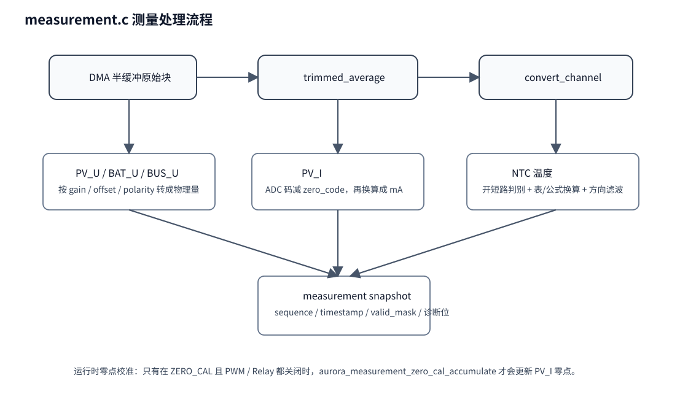

# 03｜measurement 测量模块代码分析

## 1. 模块职责

`measurement.c` 的职责是：

> **把 ADC DMA 原始采样块，变成后续控制模块可以直接使用的物理量快照。**

它不是简单的“ADC 读数转电压”，而是完整完成：

- 去极值平均；
- 通道线性标定；
- PV 电流零点处理；
- NTC 开短路判别；
- 温度换算；
- 温度方向滤波；
- 发布统一测量快照。



## 2. 入口函数

### `aurora_measurement_init()`

作用：

- 初始化 `aurora_measurement_ctx_t`；
- 拷贝板级标定参数；
- 清理快照、零点校准上下文和诊断位。

### `aurora_measurement_process_block()`

这是主入口。输入是 **完整 DMA 半块**。

它做的事可以按顺序理解：

1. 校验块长度；
2. 对每个逻辑通道做 `trimmed_average()`；
3. 电压、电流通道调用 `convert_channel()`；
4. NTC 调用 `ntc_status_from_raw()` 判定开路/短路/正常；
5. 再调用 `ntc_temperature_dC()` 做温度换算；
6. 使用 `directional_temperature_filter()` 做温度方向滤波；
7. 填充 `aurora_measurement_t`；
8. 递增 `sequence`，更新时间戳与 valid_mask。

### `aurora_measurement_read()`

作用：

- 读取最新测量快照；
- 相当于为后续模块提供稳定只读视图。

## 3. 为什么先去极值平均

`trimmed_average()` 的意义，是在一个 DMA 块里先把最异常的样本影响降下来。
这样比直接取平均值更稳，尤其对：

- PV 电流抖动；
- NTC 噪声；
- 高阻分压通道；
- DMA 一块内部的偶发毛刺。

## 4. 通道标定的理解方式

### 电压通道

对 `PV_U / BAT_U / BUS_U`，本质就是：

```text
物理量 = 原始码 × gain + offset
```

其中 gain 与 divider 来自 `drv_board_get_adc_calibration()`。

### 电流通道

对 `PV_I`，比电压多一步：

```text
等效电流码 = 原始码 - zero_code
```

再乘 gain、再乘极性。

所以 **zero_code 是 PV_I 是否可信的关键**。

## 5. PV_I 零点校准为什么存在

当前工程里，PV 输入电流是后面很多控制和保护的基础：

- `pv_power_mw = pv_voltage_mv × pv_current_ma`
- MPPT 要看功率变化；
- 保护要看过流、过功率；
- 遥测要上报输入电流和功率。

如果 0A 零点漂了，那么：

- 弱光时会凭空出现“有功率”；
- 无输入时会误判仍在运行；
- 功率限幅会偏；
- 保护阈值会变形。

### 相关函数

- `aurora_measurement_zero_cal_reset()`：重置零点校准窗口；
- `aurora_measurement_zero_cal_accumulate()`：在满足条件时不断吸收数据块；
- `aurora_measurement_zero_cal_ready()`：判断本轮零点是否已经建立；
- `aurora_measurement_zero_cal_failed()`：判断本轮是否失败。

### 谁调用它

- `main.c` 的 `aurora_app_on_adc_block()` 会在 `AURORA_POWER_ZERO_CAL` 阶段额外调用 `aurora_measurement_zero_cal_accumulate()`。
- `power_stage.c` 会根据 `zero_cal_ready / zero_cal_failed` 决定是否能继续启动。

## 6. NTC 温度链怎么理解

代码里两路 NTC：

- `NTC_MOS`
- `NTC_AMB`

### 处理过程

1. 先看原始码是否接近 0 或接近满量程；
2. 判定 `OPEN / SHORT / OK`；
3. 正常时按 100K/B3950 曲线换算到 0.1°C；
4. 用 `directional_temperature_filter()` 做方向性滤波。

### 为什么做方向性滤波

温度保护不是越快越好，而是要 **既不过慢，也不能因为一点抖动来回切换**。
因此会对温升和降温采用更合理的滤波策略。

## 7. measurement 的输出被谁用

| 使用者 | 用法 |
|---|---|
| `charger.c` | 读取电池电压、估算电池电流、温度状态 |
| `mppt.c` | 读取 PV 电压/电流/功率 |
| `protection.c` | 读取所有保护相关量 |
| `power_stage.c` | 读取 PV、BAT、BUS 三个核心电压和功率 |
| `protocol.c` | 把测量值打包成遥测 |
| `ui.c` | 不直接使用测量值，但受故障结果影响 |

## 8. 读源码时优先看的函数顺序

1. `aurora_measurement_process_block()`
2. `trimmed_average()`
3. `convert_channel()`
4. `ntc_status_from_raw()`
5. `ntc_temperature_dC()`
6. `directional_temperature_filter()`
7. `aurora_measurement_zero_cal_accumulate()`
