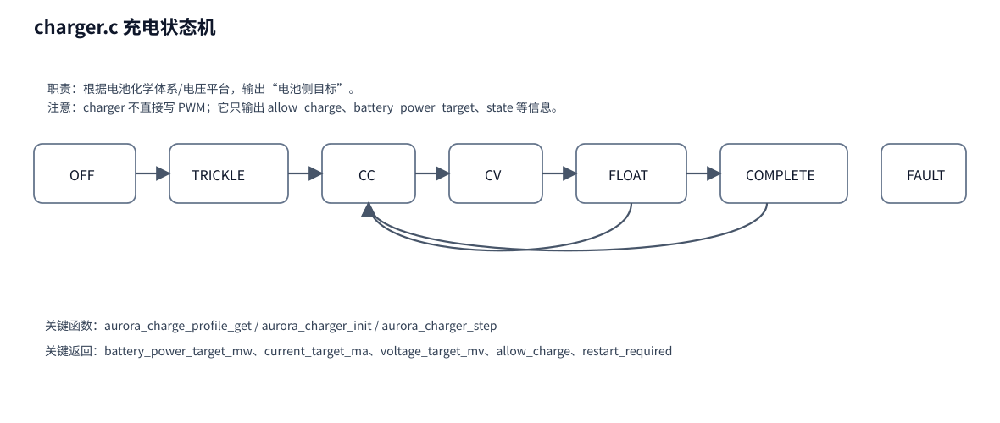

# 04｜charger 充电状态机代码分析

## 1. 模块职责

`charger.c` 不负责发波，也不直接控制继电器。它负责的是：

> **根据电池化学体系、平台、电池电压与估算电流，决定当前应该处于什么充电阶段，以及当前允许给 power_stage 多大的目标。**

所以你要把 charger 理解成：**电池侧目标生成器**。

## 2. 三个最关键函数

### `aurora_charge_profile_get()`

作用：

- 根据 `chemistry + pack` 选择一套档案；
- 里面包含：欠压、过压、CV 目标、浮充目标、电流限制等参数。

### `aurora_charger_init()`

作用：

- 根据设置初始化充电状态机；
- 设置默认状态、积分器、时间戳、档案信息。

### `aurora_charger_step()`

这是主函数。每 10ms 左右由 `aurora_app_step_1ms()` 调一次。

它输出 `aurora_charge_output_t`，主要字段有：

- `state`
- `allow_charge`
- `battery_power_target_mw`
- `current_target_ma`
- `voltage_target_mv`
- `restart_required`

## 3. 状态机怎么走

### OFF

入口态。它不长期停留，进入后会根据当前电池电压直接跳到：

- `TRICKLE`：电池电压低于涓流退出阈值；
- `CC`：否则直接进入恒流。

### TRICKLE

用于低压电池。目标是小电流唤醒/恢复电池电压。
达到 `trickle_exit_mv` 并保持一段时间后，进入 `CC`。

### CC

恒流主充。
重点不是“电流硬恒定”，而是输出一个 **电池侧功率/电流目标**。
当电池电压靠近 `cv_target_mv`，会通过积分评分 `cc_to_cv_score` 决定何时进入 `CV`。

### CV

恒压吸收。
目标是把电压稳定在 `cv_target_mv` 附近，同时观察尾流条件。

如果满足：

- 非弱光；
- 非热限幅；
- 非输入限幅；
- 电压在 `cv_min_mv ~ cv_max_mv`；
- 估算电池电流低于尾流阈值；
- 持续时间达到 `AURORA_TAIL_HOLD_MS`；

则：

- 铅酸转 `FLOAT`；
- 其他体系转 `COMPLETE`。

### FLOAT

只对铅酸有效。
分两段理解：

1. 先等待真正进入浮充窗口；
2. 进入后按 `float_target_mv` 维持，并观察是否结束或是否需要重新回到 CC。

### COMPLETE

充满完成。
如果电池掉到 `recharge_mv` 以下并保持足够时间，则请求 `restart_required`，重新回充。

### FAULT

非法输入、状态越界等会进入这里。
通常这是模块自保态，不代表整个系统唯一故障来源。

## 4. 充电状态机怎样与 power_stage 配合

这是最重要的理解点。

charger 的输出不是最终动作，它只是告诉下游：

- 现在是否允许充电；
- 目标电流/电压/功率是多少；
- 是否需要重新准入；
- 当前是不是被弱光、热、输入包络限制。

然后 `power_stage.c` 会结合这些信息，决定：

- 是否继续 RUN；
- 是否临时拉低 Duty；
- 是否先退出再做 BAT 稳定性验证。

## 5. 为什么 charger 会输出 restart_required

例如：

- COMPLETE 后需要复充；
- FLOAT 维持失败，需要回到 CC；

这不是简单“状态切换”，而是意味着：

> **本轮充电会话要重新建立安全准入条件。**

所以 charger 只发出 `restart_required` 这个信号，真正如何退回、如何重新 RUN，由 `power_stage` 决定。

## 6. 关键静态辅助函数

### `current_power_target()`

把电池电流目标转换成电池功率目标。

### `voltage_power_target()`

用于 CV / Float 阶段，根据电压误差形成适合的功率目标。

### `condition_held()`

这是状态机里很常见的“去抖定时器”函数。
很多跳转不是看到条件成立就立刻切，而是要求条件持续成立一段时间。

## 7. 你读 charger 时的建议顺序

1. 先看 `aurora_charge_profile_get()`，知道每个状态机是围绕什么参数运转；
2. 再看 `aurora_charger_step()` 的 `switch(state)`；
3. 最后看 `current_power_target()` 和 `voltage_power_target()`。
