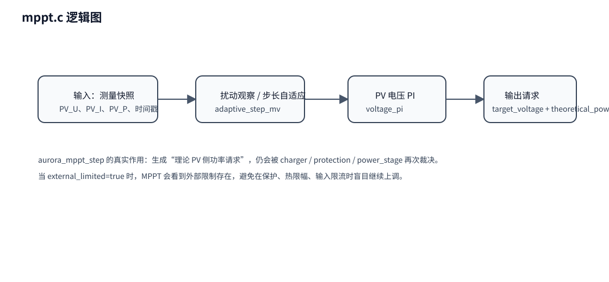

# 05｜mppt 模块代码分析

## 1. 模块定位

`mppt.c` 的职责不是“直接找到最终 Duty”，而是：

> **根据当前 PV 测量结果，生成 PV 侧的理论控制意图。**

换句话说，它是 **MPPT 外环**，而不是最终执行器。

## 2. 三个核心 API

### `aurora_mppt_init()`

初始化 MPPT 上下文。

### `aurora_mppt_reset()`

在设置切换、故障恢复、重新启动等情况下清空历史状态，避免旧积分器继续影响新一轮控制。

### `aurora_mppt_step()`

每 10ms 左右调用一次，输出：

- `target_voltage_mv`
- `theoretical_power_mw`
- `valid`

## 3. 这个 MPPT 是怎么想问题的

它的思路不是简单“电压高了降一点、电压低了升一点”，而是两层：

1. **先找参考 PV 电压**；
2. **再根据参考电压与当前 PV 电压的误差，算出理论功率请求**。

因此你会看到：

- `adaptive_step_mv()`：决定 MPPT 电压步长；
- `update_reference()`：更新 MPPT 参考电压；
- `voltage_pi()`：把电压误差变成功率请求。

## 4. 为何输出是 theoretical_power_mw

因为 MPPT 只知道“从光伏角度，希望取多少功率比较合适”。
但系统实际能不能给这么多，还要看：

- charger 是否允许；
- thermal limit 是否限功率；
- input voltage/current envelope 是否限功率；
- protection 是否允许继续运行；
- power_stage 是否处在 RUN。

所以 MPPT 输出被故意命名成：

- `theoretical_power_mw`

这提醒你：**它还不是最终可执行命令。**

## 5. `external_limited` 的意义

在 `aurora_app_step_1ms()` 中，调用 `aurora_mppt_step()` 会传入 `external_limited`。
这表示外部已经存在约束，例如：

- 热降额；
- 输入限幅；
- charger 不允许充电。

这样 MPPT 模块就不会在被外部卡住时还继续激进搜索。

## 6. 与 charger / power_stage 的关系

### 上游输入

MPPT 使用 measurement 输出的：

- `pv_voltage_mv`
- `pv_current_ma`
- `pv_power_mw`

### 下游输出

MPPT 输出给 power_stage：

- 目标理论功率
- 当前是否有效

### 和 charger 的关系

charger 决定“从电池侧最多想要多少”；MPPT 决定“从 PV 侧怎样拿比较合理”。
最后两者在 `power_stage` 里合流。

## 7. 阅读建议

阅读时先把下面顺序看懂：

1. `aurora_mppt_step()` 整体流程；
2. `adaptive_step_mv()`；
3. `update_reference()`；
4. `voltage_pi()`。

只要这四个点懂了，MPPT 的主思路就能抓住。
