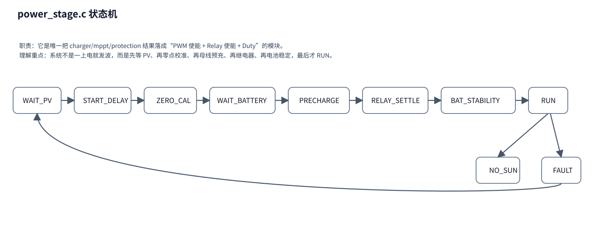

# 06｜power_stage 功率级状态机代码分析

## 1. 模块定位

如果你只挑一个文件去理解“系统真正怎么启动、怎么发波、怎么停机”，那就是 `power_stage.c`。

它的职责可以概括为：

> **把 measurement / charger / mppt / protection 的结果，裁决成最终的 PWM、Relay、Duty 命令。**

## 2. 为什么它是核心

在很多老工程里，充电状态、MPPT 和继电器逻辑容易混在一起。
而这个工程做了拆分：

- charger：决定电池充电阶段；
- mppt：决定 PV 理论取能；
- protection：决定安不安全；
- power_stage：决定能不能真正发波、何时闭合继电器、Duty 应是多少。

所以你可以把 `power_stage` 看成 **最终执行状态机**。

## 3. 关键 API

### `aurora_power_stage_init()`

初始化功率级状态为 `WAIT_PV`，并清理计时器、积分器、动态启动延时等。

### `aurora_power_stage_step()`

每 1ms 调用一次，是本模块主函数。
输出 `aurora_power_command_t`：

- `duty_q15`
- `pwm_enable`
- `relay_enable`
- `state`

## 4. 状态机逐个看

### WAIT_PV

等待 PV 输入达到启动窗口。
这里并不是只看一瞬间电压，而是要满足一定资格时间。

### START_DELAY

PV 已经够了，但不立即发波，而是再等待一段启动延时。

### ZERO_CAL

此阶段要求：

- PWM 关闭；
- Relay 断开；
- measurement 执行 PV_I 零点校准。

如果：

- 零点成功且 PV 稳定 → 进入 `WAIT_BATTERY`
- 零点失败 → 注册启动失败并转 `FAULT`

### WAIT_BATTERY

确认外部已经接入有效电池电压。
没有 BAT_U，就不允许推进。

### PRECHARGE

继电器仍断开，通过受限 Boost 先把 `BST_U` 拉起来，目的是让母线接近电池端电压。
只有 `|BUS_U - BAT_U|` 连续满足窗口，才允许进入下一步。

### RELAY_SETTLE

此时继电器闭合请求已经发出，但 PWM 仍保持 0。
等待机械稳定时间后，检查压差是否仍然合格。

### BAT_STABILITY

Relay 已闭合，但 PWM 继续关闭。
持续观察一段时间 BAT_U 是否稳定，避免接触不良、电池抖动等问题。

### RUN

只有到了这里，系统才真正进入正常 MPPT 充电运行。
在这个状态下：

- 如果 `charger->restart_required`，会退回 BAT 稳定性验证；
- 如果长时间无太阳，会进入 `NO_SUN`；
- 如果允许充电且 MPPT 有效，会计算目标功率并转成 Duty；
- 否则会把 Duty 平滑拉回 0。

### NO_SUN

无太阳停机态。
继电器断开，等待下一次重新满足启动资格。

### FAULT

故障停机态。
先保持一段释放时间，再在保护允许的情况下重新回到 `WAIT_PV`。

## 5. `power_to_duty()` 是怎么工作的

这是 `power_stage.c` 里最重要的静态函数之一。

它做三件事：

1. 基于 `PV_U` 与 `BUS_U` 做一个前馈估算；
2. 基于功率误差做 PI 修正；
3. 做占空比斜率限制。

这说明：

- 最终 Duty 不是 MPPT 直接给出来的；
- power_stage 自己带有执行器层的控制闭环。

## 6. 谁会影响 power_stage 的决策

| 输入来源 | 对 power_stage 的影响 |
|---|---|
| `measurement` | 决定 PV/BAT/BUS 是否有效，压差是否满足 |
| `charger` | 决定是否允许充电，最大允许功率，是否需要 restart |
| `mppt` | 决定理论取能请求 |
| `protection` | 决定是否必须停机 |
| `zero_cal_ready/failed` | 决定能否通过 ZERO_CAL 阶段 |

## 7. 读这个文件时的顺序建议

1. 先看 `aurora_power_stage_step()` 的大 `switch(state)`；
2. 再看 `power_to_duty()`；
3. 再看 `register_start_failure()` 和 `enter_state()`。
