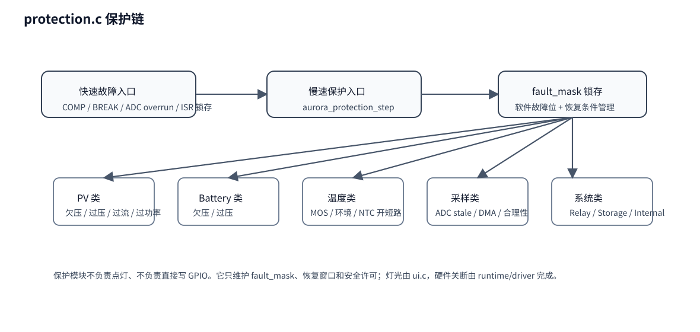

# 07｜protection 保护链代码分析

## 1. 模块定位

`protection.c` 负责的是：

> **根据测量和硬件故障来源，维护系统 fault_mask，并给出当前是否安全继续运行。**

它不是直接控制灯，也不是直接写 PWM。
但它会决定 `power_stage` 有没有资格继续 RUN。

## 2. 两类保护入口

### 第一类：快速故障

来源通常是：

- 比较器 OCP；
- PWM Break；
- ADC overrun；
- 某些 ISR 直接上报的严重错误。

这些故障会先通过 `aurora_runtime_isr_fast_fault()` 或 `aurora_runtime_isr_comparator_fault()` 快速关波，再由主循环调用：

- `aurora_app_on_fast_fault()`
- `aurora_protection_latch_fast_fault()`

完成统一锁存。

### 第二类：慢速保护

由 `aurora_protection_step()` 周期性检查，例如：

- PV 欠压/过压；
- 电池欠压/过压；
- MOS 过温；
- 环境温度异常；
- NTC 开路/短路；
- ADC 数据陈旧；
- PV 电流合理性异常；
- 存储、设置、内部故障。

## 3. 你要理解的核心产物：fault_mask

所有保护最后都归到一个 `fault_mask` 位图里。
这非常重要，因为系统后面的多个模块都围绕它工作：

- `power_stage`：决定能否继续运行；
- `ui`：决定故障灯如何组闪；
- `protocol`：决定遥测报码；
- `runtime`：决定是否应该强制保持安全态。

## 4. 保护模块对外提供什么能力

### `aurora_protection_init()`

初始化保护上下文。

### `aurora_protection_latch_fast_fault()`

把 ISR 上来的快速故障正式纳入 fault_mask。

### `aurora_protection_step()`

慢速保护主入口。

### `aurora_protection_clear()`

请求清除某些故障位。

### `aurora_protection_clear_verified_fast_fault()`

用于清除已确认恢复的快速故障。

### `aurora_protection_is_safe()`

给出当前是否允许 power_stage 继续推进。

## 5. 为什么保护不能只看“当前一帧测量值”

很多保护不能看到一次超阈值就立刻动作，否则太敏感。
所以源码里会看到：

- 定时保持；
- 迟滞恢复；
- 自动清除故障位；
- 锁存后人工/条件恢复。

这类逻辑主要通过：

- `timer_elapsed()`
- `set_fault()`
- `clear_auto_fault()`

等内部函数实现。

## 6. 与其他模块的关系

### 上游输入

- `measurement` 给出测量事实；
- `charger.profile` 提供当前电池档案阈值；
- `runtime` 提供快速故障来源。

### 下游影响

- `power_stage` 会读取 `aurora_protection_is_safe()`；
- `ui` 会读取 `fault_mask`；
- `protocol_fill_telemetry()` 会携带 `fault_mask`。

## 7. 阅读建议

1. 先看 fault bit 定义；
2. 再看 `aurora_protection_step()` 的检查顺序；
3. 最后看清除逻辑和恢复逻辑。

当你能回答“某个故障是 ISR 直接来的，还是测量慢判来的”，你就已经读懂一大半了。
