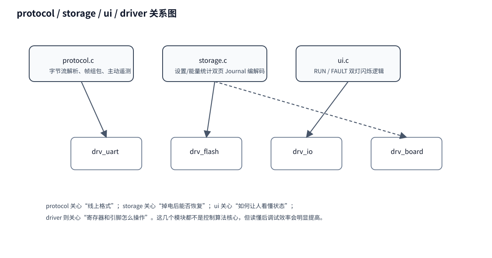

# 08｜protocol / storage / ui / driver 辅助模块代码分析

这些模块不是主控制算法核心，但它们决定了：

- 外部怎么和系统通信；
- 参数和能量掉电后是否还在；
- 人怎么从指示灯看懂设备状态；
- 硬件动作最终由谁落实。

## 1. protocol.c：协议解析与遥测

### 作用

- 解析 UART 字节流；
- 组包、编码应答；
- 周期性主动上报遥测。

### 关键函数

- `aurora_protocol_init()`
- `aurora_protocol_feed_byte()`
- `aurora_protocol_take_frame()`
- `aurora_protocol_encode()`
- `aurora_protocol_fill_telemetry()`

### 你要看懂的几个资源号

- `AURORA_PROTOCOL_RESOURCE_USER_DATA`：遥测
- `AURORA_PROTOCOL_RESOURCE_SETTING`：设置写入
- `AURORA_PROTOCOL_RESOURCE_RESET`：能量清零

### 调用关系

- `USART_IRQHandler()` 只搬字节；
- `process_uart()` 调 `feed_byte()`；
- 拿到完整帧后，由 `aurora_app_on_protocol_frame()` 处理业务；
- 周期遥测由 `aurora_runtime_poll()` 触发，调用 `fill_telemetry()` + `encode()` + `drv_uart_send()`。

## 2. storage.c：双页 Journal 持久化

### 作用

- 维护 RAM 中的持久化设置；
- 编码成 Flash 页；
- 从两页中恢复最新有效记录；
- 保存能量统计历史。

### 关键函数

- `aurora_storage_init_defaults()`
- `aurora_storage_mark_dirty()`
- `aurora_storage_encode_page()`
- `aurora_storage_classify_page()`
- `aurora_storage_decode_page()`
- `aurora_storage_energy_history_update()`
- `aurora_storage_energy_history_checkpoint()`

### 重点理解

它不是“想到就写 Flash”，而是：

1. 先在 RAM 中改；
2. `mark_dirty()` 记脏；
3. 主循环到合适时机再落盘。

这能减少擦写次数，也能降低运行中打断控制的风险。

## 3. ui.c：双灯状态机

### 作用

- 根据 `power_state` 和 `fault_mask`，输出：
  - `led_run_on`
  - `led_fault_on`

### 关键函数

- `aurora_ui_init()`
- `aurora_ui_step()`
- `fault_blink_count()`

### 你读它时关注什么

不是 GPIO 怎么点灯，而是：

- 哪些 fault 被归为 1 次闪 / 2 次闪 / 3 次闪；
- RUN 灯在 WAIT_PV、RUN、FAULT 时各是什么节奏。

真正点灯动作发生在：

- `drv_io_set_leds()`

## 4. driver 层：硬件契约层

### 核心文件

| 文件 | 作用 |
|---|---|
| `drv_adc.c` | ADC + DMA 双半缓冲采样 |
| `drv_pwm.c` | PWM 输出、断波、Break、占空比提交 |
| `drv_comp.c` | 比较器快速故障链 |
| `drv_io.c` | 继电器、LINK、LED GPIO |
| `drv_uart.c` | 串口收发 |
| `drv_flash.c` | Flash 读擦写 |
| `drv_system.c` | 时基、IRQ、供电稳定确认 |
| `drv_watchdog.c` | IWDT |
| `drv_board.c` | 板级常量、标定、门禁 |

### 读 driver 的顺序建议

1. `drv_board.c`：先知道板级常量、标定、门禁；
2. `drv_adc.c`：看扫描顺序；
3. `drv_pwm.c`：看 Duty 和 Break；
4. `drv_io.c`：看继电器和 LED 极性；
5. `drv_system.c`：看时间和供电稳定；
6. 其余按需看。

## 5. 这些辅助模块如何帮助你调试

- 遥测异常时，先看 `protocol.c`
- 参数掉电丢失时，先看 `storage.c`
- 灯不按预期闪时，先看 `ui.c`
- 继电器或 PWM 不动作时，先看 `drv_io.c` / `drv_pwm.c`
